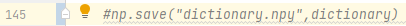

# Speed_Sign_Recognising
 
#Projekt zaliczeniowy z przedmiotu Wprowadzenie do Sztucznej Inteligenci

* [Wprowadzenie](##Wprowadzenie)
* [Technologie](##Technologie)
* [Uruchomienie](##Uruchomienie)

##Wprowadzenie
Projekt powstaje w celu realizacji zadania projektowego.
Zadaniem projektowym jest stworzenie systemu wykrywającego oraz klasyfikującego znaki drogowe na zdjęciach.
Oczekiwany efekt jest uzyskiwany dzięki zastosowaniu uczenia maszynowego, program po przejściu etapu nauki,
jest w stanie klasyfikować znaki na zdjęciach w podanych wycinkach. W celu realizacji części uczenia 
maszynowego, została użyta dedykowana do tego biblioteka: sklearn.


##Technologie
* Python 3.9
* Opencv-Python 4.5.5.62
* Numpy 1.21.2
* Lxml 4.8.0
* Sklearn - Sckit-Learn 1.0.2
* Pathlib


##Uruchomienie


Aby program działał poprawnie, podczas pierwszego uruchomienia należy
odkomentować linię następującą linię kodu:


Program posiada funkcje sprawdzającą istnienie folderów train oraz test,
w przypadku wykrycia braku powyższych, sam stworzy foldery oraz podzieli pliki w odpowiedni sposób(podczas sprawdzania poprawności działania projektu, funkcjonalność ta nie będzie wykorzysywana).

Aby sprawdzić poprawność klasyfikacji należy wprowadzić dane na wejście w odpowiednim formacie:
```
classify
n_files
file_1
n_1
xmin_1_1 xmax_1_1 ymin_1_1 ymax_1_1
...
xmin_1_n_1 xmax_1_n_1 ymin_1_n_1 ymax_1_n_1
file_2
n_2
xmin_2_1 xmax_2_1 ymin_2_1 ymax_2_1
...
xmin_2_n_2 xmax_2_n_2 ymin_2_n_2 ymax_2_n_2
...

Gdzie:

n_files - liczba plików do przetworzenia.
file_1 - nazwa 1. zdjęcia.
n_1 - liczba wycinków obrazu do sklasyfikowania na 1. zdjęciu.
xmin_1_1 xmax_1_1 ymin_1_1 ymax_1_1 - współrzędne prostokąta zawierającego pierwszy wycinek obrazu na 1. zdjęciu.

```
Przykład wprowadzonego wejścia oraz wyjścia uzyskanego dla poniższych danych:


##Źródła:
* https://github.com/briansrls/SIFTBOW/blob/master/SIFTBOW.py
* https://www.datacamp.com/community/tutorials/random-forests-classifier-python
* https://docs.python.org/3.9/index.html
* Practical Machine Learning with Scikit-Learn - https://www.udemy.com/course/machine-learning-one-hour/learn/lecture/20443051?components=buy_button%2Ccacheable_buy_button%2Cpurchase%2Crecommendation#overview


